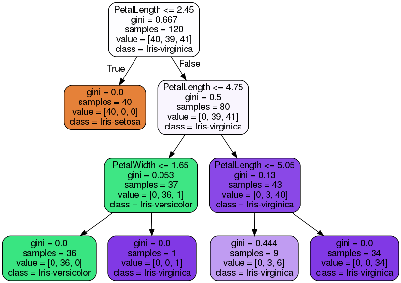

# Directory Structure
```text
.
├── data
│   └── iris_data.csv
├── figures
│   ├── DecTree-cv-entropy-graph.png
│   ├── DecTree-cv-gini-graph.png
│   ├── DecTree-gs-graph.png
│   ├── DecTree-split-entropy-graph.png
│   ├── DecTree-split-gini-graph.png
│   ├── Figure_cm-accuracy:0.90criterion:ginimax_depth:3max_features:None.png
│   ├── Figure_cm-accuracy:0.95DecTree-split-entropy.png
│   ├── Figure_cm-accuracy:0.95DecTree-split-gini.png
│   ├── Figure_cm-accuracy:1.00DecTree-cv-entropy.png
│   └── Figure_cm-accuracy:1.00DecTree-cv-gini.png
├── graph
│   ├── DecTree-cv-entropy-graph.dot
│   ├── DecTree-cv-entropygraph.dot
│   ├── DecTree-cv-gini-graph.dot
│   ├── DecTree-cv-ginigraph.dot
│   ├── DecTree-gs-graph.dot
│   ├── DecTree-split-entropy-graph.dot
│   └── DecTree-split-gini-graph.dot
├── run.py
├── utils
│   ├── data.py
│   ├── __init__.py
│   ├── model.py
│   └── plot.py
└── weights
    ├── DecTree-cv-tmtla.pkl
    ├── DecTree-cv-ylm92.pkl
    ├── DecTree-gs-dxz2k.pkl
    ├── DecTree-split-aca1b.pkl
    └── DecTree-split-r7u4h.pkl

5 directories, 28 files
```

# Command Line Interface
```text
usage: run.py [-h] [--load LOAD] [--criterion {gini,entropy}]
              [--method {cv,split}] [--gs GS]

optional arguments:
  -h, --help            show this help message and exit
  --load LOAD           True: Load trained model False: Train model default:
                        False
  --criterion {gini,entropy}
                        Construct the Decision Tree based on entropy or gini
  --method {cv,split}   Cross-Validation or Train-Test-Split Method
  --gs GS               Find optimal parameters with 10-Fold GridSearchCV
```

# Install Graphviz to Visualize DecisionTree
```shell
 sudo apt install graphviz
 ```

# DecisionTree Parameters
```text
criterion: gini, entropy
```
```text
max-Depth: 1, 2, 3, 4, 5, 6, 7, 8, 9
```
```text
max-features: sqrt, log2, None (n_features)
```
# Additional CLI parameters
```text
method: cv,split
```
```text
gs: yes or no
```
# Train the DecisionTree model

## Experiment 1

### Parameters
```text
criterion: gini
```
```text
method: split
```
### CLI

```shell
python run.py --criterion gini --method split
```
### Confusion Matrix


### Accuracy Score: 0.95

### Visualize the trained DecisionTree


## Experiment 2

### Parameters
```text
criterion: gini
```
```text
method: cv
```
### CLI

```shell
python run.py --criterion gini --method cv
```
### Confusion Matrix


### Accuracy Score: 1.00

### Visualize the trained DecisionTree


## Experiment 3

### Parameters
```text
criterion: entropy
```
```text
method: split
```
### CLI

```shell
python run.py --criterion entropy --method split
```
### Confusion Matrix


### Accuracy Score: 0.95

### Visualize the trained DecisionTree


## Experiment 4

### Parameters
```text
criterion: entropy
```
```text
method: cv
```
### CLI

```shell
python run.py --criterion entropy --method cv
```
### Confusion Matrix


### Accuracy Score: 1.00

### Visualize the trained DecisionTree


##  Experiment 5

### Parameters
```text
gs: yes
```

### CLI

```shell
python run.py --gs yes
```
### Confusion Matrix


### Accuracy Score: 0.90

### Visualize the trained DecisionTree



